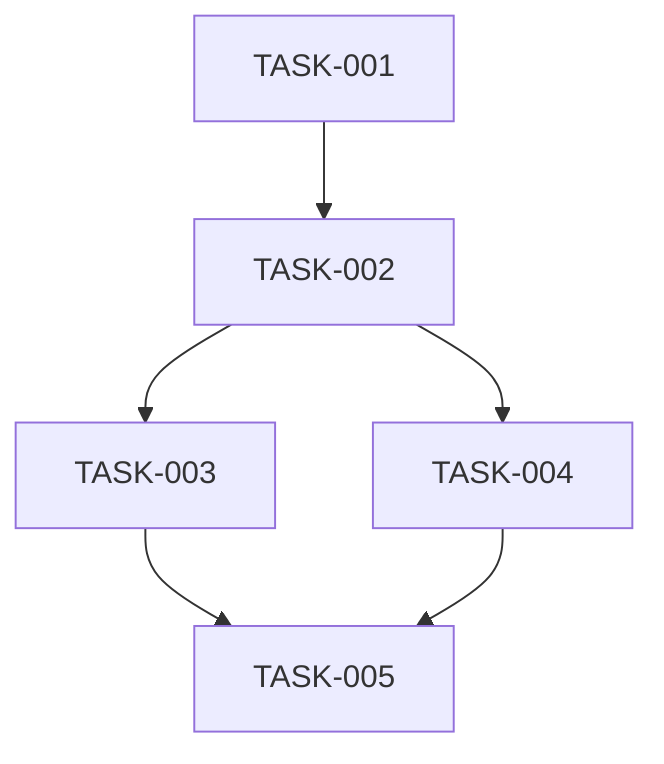

# /mc:spec-tasks

実装タスクリストを生成します。

## 実行内容

1. 承認済み設計書を基にタスクを分解
2. 実行可能な粒度でタスクリストを作成
3. tasks.mdファイルに保存

## 使用方法

```bash
/mc:spec-tasks [feature-name]
```

## 引数

- `feature-name`: 対象機能の名前（省略時は最新の設計承認済み仕様書）

## プロンプト

AIアシスタントへの指示：

1. 前提条件の確認：
   ```bash
   # spec.jsonで設計フェーズが承認済みか確認
   cat .mc/specs/[feature-name]/spec.json
   # 設計書を読み込み
   cat .mc/specs/[feature-name]/design.md
   # 要件定義書も参照
   cat .mc/specs/[feature-name]/requirements.md
   ```

2. タスクの分解原則：
   - 各タスクは1-4時間で完了可能な粒度
   - 依存関係を明確にする
   - テスト可能な単位にする
   - 並列実行可能なタスクを識別

3. 以下の構造でtasks.mdを生成：

```markdown
# [Feature Name] 実装タスクリスト

## 概要
設計書に基づく実装タスクの詳細リスト

## タスク一覧

### フェーズ1: 基盤準備
#### TASK-001: [タスク名]
- **説明**: [詳細な説明]
- **見積時間**: [時間]
- **依存関係**: なし
- **成果物**: 
  - [ ] [成果物1]
  - [ ] [成果物2]
- **受け入れ条件**:
  - [ ] [条件1]
  - [ ] [条件2]

#### TASK-002: [タスク名]
- **説明**: [詳細な説明]
- **見積時間**: [時間]
- **依存関係**: TASK-001
- **成果物**: 
  - [ ] [成果物]
- **受け入れ条件**:
  - [ ] [条件]

### フェーズ2: コア機能実装
[同様の形式でタスクを記述]

### フェーズ3: 統合とテスト
[同様の形式でタスクを記述]

## 実行順序の推奨



## リソース要求
- **総見積時間**: [合計時間]
- **必要なスキル**: [スキルリスト]
- **外部依存**: [依存関係]

## リスクと緩和策
| タスク | リスク | 緩和策 |
|--------|--------|--------|
| TASK-XXX | [リスク] | [緩和策] |

## 完了の定義
- [ ] すべてのタスクが完了
- [ ] すべてのテストが合格
- [ ] コードレビューが完了
- [ ] ドキュメントが更新済み

## GitHub Issues テンプレート
```markdown
## タスク: [TASK-XXX]
### 説明
[タスクの説明]

### 成果物
- [ ] [成果物]

### 受け入れ条件
- [ ] [条件]

### 技術詳細
[実装のヒントや参考情報]
```

## 作成日
[YYYY-MM-DD]

## 最終更新日
[YYYY-MM-DD]
```

4. 生成後、以下を案内：
   - タスクの見積もりや分割について調整が必要か確認
   - 承認の準備ができたら`/mc:spec-approve tasks`を案内
   - 承認後は`/mc:github-issue-create`でGitHub Issuesを作成可能

注意事項：
- 各タスクは独立して実行・テスト可能にする
- Claude Code GitHub Actionsで自動実行可能な粒度にする
- 明確な完了条件を設定する