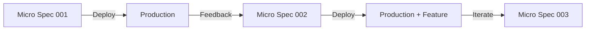

# GitHub-Driven Agile Spec Development

## 基本理念
「仕様も実装も、常にデプロイ可能な状態を保つ」

## 新しい開発フロー

### 1. Micro-Spec Pattern（マイクロ仕様パターン）
```yaml
# .mc/specs/[feature]/micro-specs/001-hello-endpoint.yml
micro_spec:
  id: 001
  title: "最小限のHelloエンドポイント"
  scope: "GET /api/hello が 200 OK を返す"
  
  # 最小限の実装で動作確認可能
  acceptance_criteria:
    - "curl http://localhost:3000/api/hello => 200 OK"
    - "レスポンス: { message: 'Hello' }"
  
  # 依存する他のマイクロ仕様
  depends_on: []
  
  # 次のステップ
  next_specs: [002-auth-middleware]
```

### 2. GitHub Issue as Living Spec
```markdown
<!-- GitHub Issue Template: .github/ISSUE_TEMPLATE/micro-spec.md -->
---
name: Micro Spec
about: 小さな動作可能な仕様
labels: micro-spec, auto-implement
---

## 🎯 Goal
<!-- 1行で表現できる具体的なゴール -->

## ✅ Acceptance Criteria
```bash
# 動作確認コマンド
curl http://localhost:3000/api/endpoint
# 期待値: { "status": "ok" }
```

## 🧪 Auto-Test
```javascript
// このテストが通れば仕様達成
test('endpoint returns ok', async () => {
  const res = await fetch('/api/endpoint');
  expect(res.status).toBe(200);
});
```

## 🔄 Continuous Deployment
- [ ] このIssueがCloseされたら自動的にステージング環境にデプロイ
- [ ] テスト通過後、本番環境へ自動昇格
```

### 3. Continuous Auto-Evolution
```bash
#!/bin/bash
# .mc/hooks/auto-evolve.sh

# 変更を検出して自動的にマイクロ仕様を生成
watch_changes() {
  # ファイル変更を監視
  fswatch -o src/ | while read change; do
    # 変更から仕様を推測
    ./mc analyze-change $change
    
    # マイクロ仕様の自動生成
    ./mc create-micro-spec --auto
    
    # GitHub Issueとして作成
    gh issue create --label "auto-spec"
  done
}
```

### 4. Progressive Enhancement Flow


## GitHub Actions Integration

### Auto-Implementation Workflow
```yaml
# .github/workflows/auto-implement.yml
name: Auto Implement Micro Spec

on:
  issues:
    types: [labeled]

jobs:
  implement:
    if: contains(github.event.label.name, 'micro-spec')
    runs-on: ubuntu-latest
    
    steps:
      - name: Parse Micro Spec
        run: |
          # IssueからAcceptance Criteriaを抽出
          SPEC=$(gh issue view ${{ github.event.issue.number }} --json body)
          
      - name: Generate Implementation
        run: |
          # Claude Code APIを使用して実装生成
          claude-code implement --spec "$SPEC" --minimal
          
      - name: Run Acceptance Test
        run: |
          # 仕様に記載されたテストを実行
          npm test -- --spec-test
          
      - name: Create PR
        if: success()
        run: |
          gh pr create \
            --title "Auto: ${{ github.event.issue.title }}" \
            --body "Closes #${{ github.event.issue.number }}"
```

### Continuous Spec Evolution
```yaml
# .github/workflows/spec-evolution.yml
name: Spec Evolution

on:
  pull_request:
    types: [closed]
    
jobs:
  evolve:
    if: github.event.pull_request.merged == true
    runs-on: ubuntu-latest
    
    steps:
      - name: Analyze Implementation
        run: |
          # 実装から次の仕様を推測
          ./mc analyze-implementation --pr ${{ github.event.number }}
          
      - name: Suggest Next Specs
        run: |
          # 次のマイクロ仕様を提案
          ./mc suggest-next-specs > next-specs.md
          
      - name: Create Next Issues
        run: |
          # 次のステップのIssueを自動作成
          ./mc create-next-issues --from next-specs.md
```

## Evolution-Driven Features

### 1. Spec Snapshots（仕様スナップショット）
```bash
# 現在の実装状態から仕様を自動生成
mc spec-snapshot

# 出力: .mc/snapshots/2024-01-15-143022.yml
snapshot:
  timestamp: 2024-01-15T14:30:22Z
  running_endpoints:
    - GET /api/hello: 200 OK
    - POST /api/users: 201 Created
  type_coverage: 95%
  test_coverage: 87%
  
# この状態を新しい仕様のベースラインとして使用
mc spec-from-snapshot --latest
```

### 2. Conflict-Friendly Specs
```yaml
# 複数の仕様が競合しても、両方を保持
micro_spec:
  id: 003
  conflicts:
    - with: 002
      resolution: "merge_both"
      strategy: "feature_flag"
  
  # 実装時に自動的にフィーチャーフラグを生成
  implementation:
    if: "feature_flag.auth_v2"
    then: "new_auth_logic"
    else: "existing_auth"
```

### 3. Automatic Spec Rebase
```bash
# 実装の変更に応じて仕様を自動的にリベース
mc spec-rebase --auto

# 仕様と実装の差分を検出
mc spec-diff

# 実装に合わせて仕様を更新
mc spec-sync --from-implementation
```

## 実践的な利点

1. **即座にフィードバック**: 各マイクロ仕様は数時間で実装・デプロイ可能
2. **リスク最小化**: 小さな変更なので、問題があってもすぐにロールバック
3. **継続的な価値提供**: 毎日少しずつ機能が改善される
4. **自動化による高速化**: 仕様→実装→テスト→デプロイが自動化

## 移行戦略

### 既存のMagic Circleプロジェクト
```bash
# 大きな仕様を小さなマイクロ仕様に分解
mc decompose-spec api-core --into micro-specs/

# 各マイクロ仕様をGitHub Issueに変換
mc export-to-github --micro-specs

# 自動実装ワークフローを有効化
mc enable-auto-implementation
```